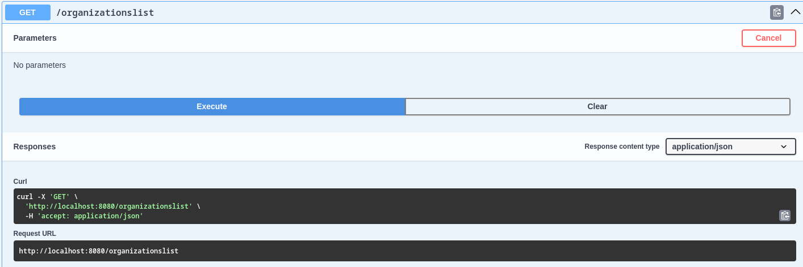

# Тестування працездатності системи

Реалізація та відображення усіх тестів відбувалася за допомогою Swagger UI.

## POST /organizations | Створення нової організації

Наша організація створюється з вказаним іменем та описанням організації, після чого організації надається id та додається в базу даних:

## GET /organizations/{id} | Відображення організації за id 

Нумо перевіримо чи додалась наша нова організація у базу даних за наведеним зверху id:

## PUT /organizations/{id} | Зміна назви та опису організації за id

Можливо у процесі створення нової організації ми помилилися з назвою чи навіть описом організації? Щоб виправити це, нам допоможе наступний нижче метод:

Перевірка, чи усе змінилося:

## DELETE /organizations/{id} | Видалення організації за id

А також іноді виникають ситуації, коли організації вже непотрібні у нашій базі даних і їх необіхдно видалити. Давайте видалимо нашу шосту організацію.

Як завжди перевіримо:

## GET /organizations | Отримання списку організацій

Ми можемо отримувати список існуючих організацій. Для початку додамо дві органцізації:

А тепер ми побачимо наш список організацій:

## Інше

Також з нашої реляційної схеми можна побачити що у користувачів є власний organizationlist який складається з організацій до яких він належить. Реалізацію подальшого можна побачити нижче:

